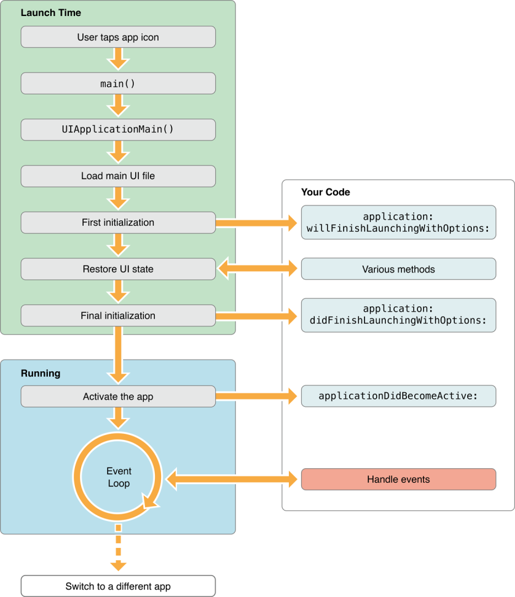
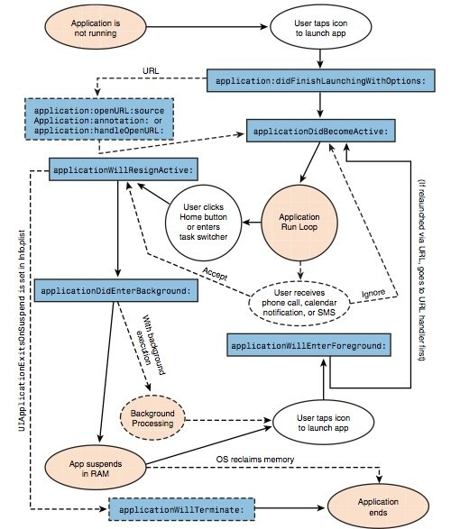

##Prework

Finalmente, investiga:
- Ciclo de vida de una app y haz un esquema de todos los estados por los que pasa un app.

Not running 
La aplicación no se ha iniciado o se estaba ejecutando, pero el sistema la finalizó.

Inactive
La aplicación se ejecuta en primer plano pero actualmente no recibe eventos. (Sin embargo, puede estar ejecutando otro código). Una aplicación generalmente permanece en este estado solo brevemente mientras pasa a un estado diferente.

Active
La aplicación se está ejecutando en primer plano y está recibiendo eventos. Este es el modo normal para aplicaciones en primer plano.

Background
La aplicación está en segundo plano y ejecuta código. La mayoría de las aplicaciones ingresan brevemente a este estado en su camino a ser suspendidas. Sin embargo, una aplicación que solicita un tiempo de ejecución adicional puede permanecer en este estado durante un período de tiempo. Además, una aplicación que se inicia directamente en segundo plano entra en este estado en lugar del estado inactivo. Para obtener información sobre cómo ejecutar el código en segundo plano, consulte Ejecución en segundo plano.

Suspended
La aplicación está en segundo plano pero no está ejecutando código. El sistema mueve las aplicaciones a este estado automáticamente y no las notifica antes de hacerlo. Mientras está suspendida, una aplicación permanece en la memoria pero no ejecuta ningún código.

application:willFinishLaunchingWithOptions: este método es la primera oportunidad de su aplicación para ejecutar código en el momento del lanzamiento.

application:didFinishLaunchingWithOptions: este método le permite realizar cualquier inicialización final antes de que su aplicación se muestre al usuario.

applicationDidBecomeActive: permite que su aplicación sepa que está a punto de convertirse en la aplicación en primer plano. Use este método para cualquier preparación de última hora.

applicationWillResignActive: le permite saber que su aplicación está dejando de ser la aplicación en primer plano. Use este método para poner su aplicación en un estado inactivo.

applicationDidEnterBackground: le permite saber que su aplicación ahora se está ejecutando en segundo plano y puede suspenderse en cualquier momento.

applicationWillEnterForeground: le permite saber que su aplicación se está moviendo del fondo y de nuevo al primer plano, pero que aún no está activa.

applicationWillTerminate: le permite saber que su aplicación está siendo finalizada. Este método no se llama si su aplicación está suspendida.

- Arquitectura Modelo Vista Controlador

Modelos: contiene una representación de los datos que maneja el sistema, su lógica de negocio, y sus mecanismos de persistencia.

Vistas: Interfaz de usuario, que compone la información que se envía al cliente y los mecanismos interacción con éste.

Controladores: Actúa como intermediario entre el Modelo y la Vista, gestionando el flujo de información entre ellos y las transformaciones para adaptar los datos a las necesidades de cada uno.

#Swift

- Optionals
Un opcional en Swift es un tipo que puede contener un valor o ningún valor. Los opcionales se escriben agregando un ? A cualquier tipo:
var middlename: String?
Lo anterior significa que el segundo nombre puede ser una cadena o no contiene nada representado por el ?. Un opcional es un tipo de contenedor. Una cadena opcional es un contenedor que puede contener una cadena. Un Int opcional es un contenedor que puede contener un Int. Piense en un opcional como una especie de paquete. Antes de abrirlo (o "desenvolverlo" en el idioma de las opciones) no sabrá si contiene algo o nada. Es solo un valor opcional que se puede establecer en nulo.

- Force unwrapping
Los opcionales representan datos que pueden o no estar allí, pero a veces usted sabe con certeza que un valor no es nulo. En estos casos, Swift le permite hacer un force unwrapping: conviértalo de un tipo opcional a un tipo no opcional.
Puede desenvolver su variable opcional con el operador "!" Pero es una forma de ajuste menos segura, debe asegurarse de que la variable contenga valor o no. Si no utiliza el método de desenvolvimiento forzado en el lugar correcto, su aplicación puede bloquearse.

- Optional binding
Puede desenvolver su variable opcional con la declaración if let. Significa que si su variable no es nula, se desenvolverá en la constante creada, entonces puede usar esta constante en el bloque de declaración if let.
Simplemente permite el uso del valor no opcional en el bloque de instrucciones, por lo que es una forma totalmente segura de desenvolver los opcionales.

- Type Casting
La conversión de tipos es una forma de verificar el tipo de una instancia, o tratar esa instancia como una superclase o subclase diferente de cualquier otro lugar en su propia jerarquía de clases.
La conversión de tipos en Swift se implementa con los operadores is y as. Estos dos operadores proporcionan una forma simple y expresiva de verificar el tipo de un valor o emitir un valor a un tipo diferente.

- Guard
Guard combina dos conceptos poderosos en Swift: desenvolvimiento opcional y cláusulas where. La primera nos permite evitar la pirámide de la fatalidad o su alternativa, la muy larga declaración if let. El último adjunta expresiones simples pero poderosas con la cláusula where para que podamos examinar aún más los resultados que estamos validando.

#Storyboard - UI

- Segues
Use segues para definir el flujo de la interfaz de su aplicación. Un segue define una transición entre dos controladores de vista en el archivo de guión gráfico de su aplicación. El punto de partida de un segue es el botón, la fila de la tabla o el reconocedor de gestos que inicia el segue. El punto final de un segue es el controlador de vista que desea mostrar. Un segue siempre presenta un nuevo controlador de vista, pero también puede usar un segue de desenrollado para descartar un controlador de vista.

- UINavigationController
Un controlador de navegación es un controlador de vista de contenedor que administra uno o más controladores de vista secundarios en una interfaz de navegación. En este tipo de interfaz, solo se puede ver un controlador de vista secundario a la vez. Al seleccionar un elemento en el controlador de vista, se empuja un nuevo controlador de vista en pantalla utilizando una animación, ocultando así el controlador de vista anterior. Al tocar el botón Atrás en la barra de navegación en la parte superior de la interfaz, se elimina el controlador de vista superior, lo que revela el controlador de vista debajo.

- UITabBarController

La interfaz de la barra de pestañas muestra pestañas en la parte inferior de la ventana para seleccionar entre los diferentes modos y para mostrar las vistas para ese modo.
Cada pestaña de una interfaz de controlador de barra de pestañas está asociada con un controlador de vista personalizado. Cuando el usuario selecciona una pestaña específica, el controlador de la barra de pestañas muestra la vista raíz del controlador de vista correspondiente, reemplazando cualquier vista anterio. Las interfaces de la barra de pestañas se usan comúnmente para presentar diferentes tipos de información o para presentar la misma información usando un estilo de interfaz completamente diferente.
